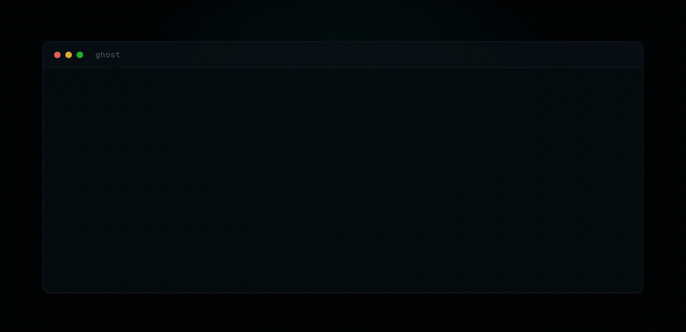

# ghost 👻

[](LICENSE) &nbsp; &nbsp;[](https://github.com/NousResearch/hermes-agent) &nbsp;

**A private, unrestricted agentic harness.** A real terminal agent that runs commands, edits files, executes code, and searches the web, with every hosted request routed through OpenGradient's TEE gateway so the model provider never sees your prompts. It answers what you actually ask, drops to a fully-offline local model on demand, and phones home to no one.

Built on the [Hermes Agent](https://github.com/NousResearch/hermes-agent) engine by Nous Research, wired to OpenGradient's gateway and to only open-weight, unrestricted models.

<p align="center">
  
</p>

## Install (30 seconds)

One deterministic command, no LLM and nothing agentic, installs **and** updates everything (the engine, the privacy stack, the `ghost` commands) on macOS, Linux, or WSL2. uv provisions an isolated Python 3.11 under the hood, so the only prerequisite is `git`:

```bash
curl -fsSL https://raw.githubusercontent.com/OpenGradient/ghost/main/install.sh | bash
```

Then:

```bash
ghost-login     # connect your account once (browser login)
ghost           # start chatting (default: DeepSeek V4 Pro, private via the TEE gateway)
```

Re-run the same command, or `ghost update`, to update. From a local clone it's just `./install.sh`. Want the offline local model too? `GHOST_LOCAL=1 ...`.

## Why ghost exists

### Problem #1: The Model Lectures You Instead of Working

> "The Net interprets censorship as damage and routes around it."
>
> John Gilmore, [EFF cofounder](https://en.wikipedia.org/wiki/John_Gilmore_(activist))

**The Problem.** Frontier models refuse, moralize, and water answers down. You ask something direct, security research, something adult, something dual-use, something merely uncomfortable, and you get a disclaimer and a redirect to "safer alternatives."

**The Fix.** ghost only connects **open-weight, unrestricted models** (DeepSeek V4 Pro by default; Hermes 4 405B/70B) and applies a per-model steer, so the default answers in full with no sermon. Closed, refusing models (Claude, GPT, Gemini, Grok) aren't offered, and the gateway rejects anything off the list. It treats you as a competent adult, but it isn't an edgelord either: it won't volunteer illegal or shock content, it just won't refuse you.

### Problem #2: The Provider Reads Everything You Send

> "Privacy is the power to selectively reveal oneself to the world."
>
> Eric Hughes, [A Cypherpunk's Manifesto](https://www.activism.net/cypherpunk/manifesto.html)

**The Problem.** "Hosted inference" means your prompts, your code, your secrets, whatever you're working on, land in plaintext on someone else's servers, logged and trained on.

**The Fix.** Every hosted request is HPKE/OHTTP-encrypted by [og-veil](https://github.com/OpenGradient/veil) and run inside a **TEE enclave**: the relay sees only ciphertext and never the prompt, the enclave runs the model but never learns who you are, and og-veil verifies the enclave's signature before a single token reaches you. Need zero egress? `ghost --local` runs an offline model where nothing leaves the box.

> [!TIP]
> And it doesn't give up. Most agents stop and ask after the first error; ghost reads the actual error, installs what's missing, changes tactics, and keeps going until the task is done. Set a standing goal with `/goal <objective>` and it works toward it across turns on its own.

## ghost vs the alternatives

|  | ghost | a vanilla coding agent | a hosted chat app |
|---|:---:|:---:|:---:|
| Provider sees your prompts | **No** -- TEE + OHTTP | Yes | Yes |
| Refuses / moralizes | **No** -- open-weight + steer | Often | Often |
| Runs fully offline | **Yes** -- `--local` | No | No |
| Real terminal + tools | **Yes** | Yes | No |
| Open-weight models | **Only** | Rarely | Rarely |
| Install needs an LLM | **No** -- one `curl` | Sometimes | n/a |

## The model line-up

Switch with `/model`, all open-weight, nothing closed or refusing:

| Model | What it is |
|---|---|
| `deepseek/deepseek-v4-pro` **(default)** | Strongest open reasoning + coding model; uncensored via ghost's steer. |
| `nous/hermes-4-405b` | Flagship uncensored open model, the most steerable. Also the hosted fallback. |
| `nous/hermes-4-70b` | Fast, low-cost; runs ghost's auxiliary tasks. |
| local (opt-in) | Abliterated 7B / 32B via `GHOST_LOCAL`, fully offline, zero egress. |

## How the private path works

<details>
<summary>The full request path: bridge → og-veil → TEE enclave</summary>

```
ghost engine
  └─ bridge (:8788)       strip provider prefix, model steer (+ PII/secret scrub if --scrub)
       └─ og-veil (:11435)   HPKE-encrypt, OHTTP relay, verify signature before emit
            └─ chat-api relay   sees your account token + IP, but only ciphertext
                 └─ TEE enclave   decrypts, runs the model, signs the output
```

Two boundaries, the same path the [chat.opengradient.ai](https://chat.opengradient.ai) site uses: the **relay** sees your account + IP but only ciphertext; the **enclave** sees the prompt but never your identity. So the hosted path is **private, not anonymous** -- your account is still authenticated and the relay sees your IP. For true anonymity, use the local model (zero egress).

</details>

## Honest limits

- **The local model is opt-in and weaker.** Off by default (`GHOST_LOCAL`); it's a weaker agentic searcher and may still lean on the hosted gateway for tool orchestration.
- **The engine is forked, not rewritten.** Internal package names stay `hermes_cli`, and `ghost update` (not `hermes update`) is what refreshes the fork.

## License

[MIT](LICENSE). The Hermes Agent engine it builds on is under its own license.

## Security

ghost is a privacy tool; a PII/secret leak is treated as a P0. See [SECURITY.md](SECURITY.md) for how to report one privately.
